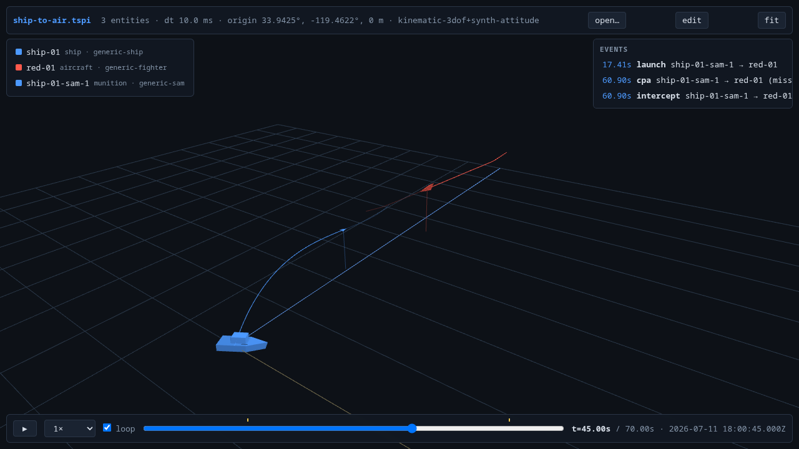

# From manifest to pixels — the whole pipeline in one run

One JSON file in, one `.tspi` trajectory file out, one browser tab to watch it.
This walkthrough drives the **ship-to-air reference engagement** (a surface vessel
launching a SAM at an inbound fighter — the ICD's reference case) through every
stage: authoring input → simulation → the recorded file → the browser viewer.
Every command runs from the repo root and every output shown is real — re-run any
of it and you get byte-identical results, because that is the point of this engine.

Setup once (.NET 8 SDK from https://dot.net; both shells are supported and every
command after this block is identical in either):

```sh
# bash / zsh (Linux, macOS, WSL)
dotnet build src/Tspi.sln -c Release
alias tspi="dotnet $PWD/src/artifacts/bin/Tspi.Cli/Release/net8.0/tspi.dll"
```

```powershell
# PowerShell (Windows; forward slashes are fine on .NET)
dotnet build src/Tspi.sln -c Release
$TspiDll = "$PWD/src/artifacts/bin/Tspi.Cli/Release/net8.0/tspi.dll"
function tspi { dotnet $TspiDll @args }
```

## 1. The input: one manifest, three sections

`schemas/examples/ship-to-air.json` is the entire scenario definition. It has three
parts: **scene** (where/when/air), **entities** (the platforms), and **munitions**
(their own top-level section — each names its launcher via `parent`).

The scene anchors a local NED frame at a WGS-84 origin and defines the air mass —
layered wind plus seeded Gauss-Markov gusts:

```json
"scene": {
  "origin_lla": { "lat_deg": 33.9425, "lon_deg": -119.4622, "alt_m": 0.0 },
  "epoch": "2026-07-11T18:00:00Z",
  "duration_s": 70.0,
  "dt_s": 0.01,
  "environment": {
    "atmosphere": "exp8500",
    "wind": {
      "layers": [
        { "alt_msl_m": 0,    "from_deg": 290, "speed_mps": 7 },
        { "alt_msl_m": 6000, "from_deg": 260, "speed_mps": 18 }
      ],
      "gusts": { "model": "gauss_markov", "sigma_mps": 1.2, "tau_s": 5.0 }
    }
  }
}
```

The platforms: a ship steaming north at 8 m/s, and a fighter inbound at 6 km
altitude. Behavior is a command timeline (`maneuvers`), and the target carries
`dispersions` — 1-sigma initial-condition spreads that make Monte-Carlo sweeps
produce genuinely different engagements per seed. `model` names resolve to
`models/<name>.json` (all parameters notional):

```json
"entities": [
  {
    "id": "ship-01", "team": "blue", "type": "ship", "model": "generic-ship",
    "initial": { "pos_ned_m": [0, 0, 0], "vel_ned_mps": [8, 0, 0] },
    "maneuvers": [
      { "at_s": 20.0, "lateral": { "kind": "turn_to_heading", "heading_deg": 40, "g_limit": 0.2 } }
    ]
  },
  {
    "id": "red-01", "team": "red", "type": "aircraft", "model": "generic-fighter",
    "initial": { "pos_ned_m": [35000, 4000, -6000], "vel_ned_mps": [-250, 0, 0] },
    "dispersions": { "pos_ned_sigma_m": [900, 900, 200], "vel_ned_sigma_mps": [15, 15, 3] },
    "maneuvers": [
      { "at_s": 12.0,
        "lateral":  { "kind": "turn_to_heading", "heading_deg": 205, "g_limit": 5 },
        "vertical": { "kind": "delta_alt", "delta_m": -2000, "rate_mps": 40 } }
    ]
  }
]
```

And the munitions section. The SAM launches when the target closes inside 30 km;
`eject_mps`/`elevation_deg` are the VLS-style booster kick that lofts it off the
near-stationary deck. Swap `guidance` to `{ "kind": "nn", "policy": "..." }` and a
learned policy flies instead — same manifest, same everything else:

```json
"munitions": [
  {
    "id": "ship-01-sam-1",
    "parent": "ship-01",
    "model": "generic-sam",
    "target": "red-01",
    "launch": { "when": "range_to_target", "less_than_m": 30000, "eject_mps": 35, "elevation_deg": 70 },
    "guidance": { "kind": "pronav", "gain": 3.5 }
  }
]
```

## 2. Validate

Schema conformance is checked in CI (`scripts/check_schemas.py`); the CLI adds the
semantic checks — ids resolve, model kinds match entity types, launch windows fit
the scenario, fly-outs aren't truncated:

```
$ tspi validate schemas/examples/ship-to-air.json
ok: 'ship-to-air' valid — 2 entities, 70s @ 100 Hz
```

## 3. Run

```
$ tspi run schemas/examples/ship-to-air.json -o runs/ship-to-air.tspi
wrote runs/ship-to-air.tspi
  3 entities, 18,352 samples, 1,148.7 KiB
  3 events, seed 42, 85 ms (825x real-time)
    t=  17.41s  launch  ship-01-sam-1 -> red-01
    t=  60.90s  cpa  ship-01-sam-1 -> red-01 (miss 8.394 m)
    t=  60.90s  intercept  ship-01-sam-1 -> red-01 (miss 8.394 m)
```

What just happened, in order:

1. **Platforms integrate** — fixed-step RK4 over the kinematic 3-DoF dynamics,
   maneuver channels commanding heading/altitude/speed, wind and gusts from
   per-entity seeded streams, attitude synthesized from the flight path.
2. **The launch condition resolves** — range to `red-01` crosses 30 km at
   t = 17.41 s, so the SAM is born there with the ship's velocity plus the kick.
3. **The fly-out is generated behind the `IMunitionTrajectoryModel` seam**
   (`src/Tspi.Sim/Engine/IMunitionTrajectoryModel.cs`). The stock
   `PointMassMunitionModel` flies boost + drag + gravity with pronav commanding
   inside the airframe g-limit; the endgame refines closest approach to sub-dt
   precision — that 8.394 m miss distance is inside the 12 m fuze, hence
   `intercept`. A different generator (6-DoF, an external NN fly-out producer) is
   one sibling file implementing the same interface.
4. **Everything streams to disk as it integrates** — no in-memory buffering of
   whole trajectories.

Determinism is a contract, not a hope: run it twice and compare —

```
$ tspi run schemas/examples/ship-to-air.json -o runs/again.tspi --quiet
$ tspi diff runs/ship-to-air.tspi runs/again.tspi     # byte-identical
```

## 4. What landed in the file

```
$ tspi inspect runs/ship-to-air.tspi --events --provenance
file:    runs/ship-to-air.tspi (1,148.7 KiB)
format:  v1  dt=10 ms (100 Hz)
origin:  lat 33.9425  lon -119.4622  alt 0 m
epoch:   2026-07-11 18:00:00Z
manifest sha256: b78c12afee1d63f5...

entities (3):
  ord  id                 team  type            t0      end   samples  parent
    0  ship-01            blue  ship          0.00    70.00     7,001  -
    1  red-01             red   aircraft      0.00    70.00     7,001  -
    2  ship-01-sam-1      blue  munition     17.41    60.90     4,350  0

events (3):
  t=  17.410s  launch         ship-01-sam-1 -> red-01
  t=  60.900s  cpa            ship-01-sam-1 -> red-01  {miss_m=8.394}
  t=  60.900s  intercept      ship-01-sam-1 -> red-01  {miss_m=8.394}
```

Both platforms and the munition are first-class entity blocks — position f64,
velocity/attitude/rates f32, one record per 10 ms (docs/FORMAT.md). The munition's
`t0`/`end` **are** its alive window: it does not exist before `launch` and its
last sample is the intercept. The provenance record pins the run to the exact
manifest *and* the exact model files (SHA-256 each — including guidance policy
weights when an NN flies), so any `.tspi` is attributable forever.

Analysis reads the same file zero-copy (and the launch-centred DCV view is the
struct SMEs review — docs/ICD-NN.md §3.4). After `pip install -e "tools/tspi_py[test]"`
(the command is shell-neutral; use your venv's `python`/`python3`):

```
$ python scripts/walkthrough_analysis.py runs/ship-to-air.tspi
TspiFile('runs/ship-to-air.tspi', 3 entities, dt=10 ms, events=3)
ship-01-sam-1: peak speed 679 m/s
ship-01-sam-1 in DCV: apogee 4027 m, terminal at 17.9 km downrange, intercept (miss 8.4 m)
```

## 5. Watch it in the browser

`tspi serve` hosts the dependency-free web viewer and prints a deep link:

```
$ tspi serve runs/ship-to-air.tspi
tspi serve — http://127.0.0.1:8080/
  ...
  open:    http://127.0.0.1:8080/?file=/files/runs/ship-to-air.tspi
```



That frame (t = 45 s) is the run above: the ship hull marker at the launch point,
the SAM's boost-and-climb arc closing on the red fighter's track, altitude poles
down to the sea, event ticks on the scrub bar at launch and intercept. Nothing on
screen was computed in the browser — every pose is an O(1) interpolated sample
from the file (Hermite position, slerped attitude), so scrubbing anywhere is free.
Space plays/pauses, ←/→ steps ±1 s, `F` frames the scene, clicking an entity row
follows it, clicking an event seeks to it. The munition marker appears at 17.41 s
and vanishes at 60.90 s, exactly as recorded.

Because the page is served (not just opened from disk), the **edit** button opens
the scenario editor: paste or deep-link a manifest (`/?scenario=/files/schemas/
examples/ship-to-air.json`), change a number — the launch range, the seed, the
guidance kind — and hit **run**. The CLI re-simulates (~100 ms) and the viewer
reloads the new run *at the same playback time*; determinism replays everything
before your edit identically, so it feels like branching the world from "now".

## 6. Where to go from here

- **More munitions against this run, without re-simulating it** —
  `tspi append runs/ship-to-air.tspi <addendum.json>` (old bytes never change).
- **A campaign** — `tspi sweep schemas/examples/ship-to-air.json --seeds 1:200 -j 10
  --out-dir runs/sweep`; the dispersions above make every seed a different engagement.
- **Training data** — `tspi_py.engagements()` / `tspi_py.dcv.dcv_flyouts()` rebuild
  the ICD's per-engagement views straight from run files (docs/ICD-NN.md).
- **Other viewers** — the same file plays in Unity (`unity/README.md`, includes the
  graphical scenario editor) and Godot (`godot/README.md`); `scripts/e2e.sh` runs
  this entire pipeline as one test (PowerShell: `scripts/e2e.ps1`).
